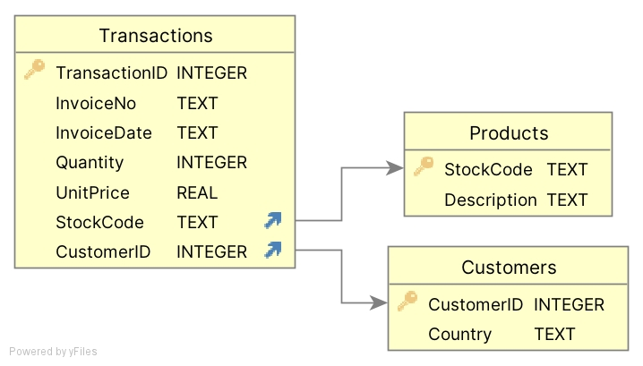

# MLOps Lecture 9 - MLOps in Business context

This repository contains lecutre slides, python scripts and dataset for the first lecture. 

## API
- **api_weather.ipynb** is an example of real public API
- **api_jokes.ipynb** is an example of simple public API
- **api_finance.ipynb**, **api_news.ipynb** are examples of limited public API using API_key (You need to register to get your private key)
- EXTRA: **joke_app.ipynb** is a simple streamlit app that uses IPA to print jokes
- EXTRA: **api_weather.ipynb** exercise from the class

## Database 
This is extra and you might not need to do it in the class!

  

- **db_create.py** reads in excel file and transform it into SQL database
- **db_queries.py** contains a few query examples
- **db_add_datapoints** add new transactions
- **db_add_columns** add new columns
- **data/Online Retail.xlsx** is dataset used to create database (https://archive.ics.uci.edu/dataset/352/online+retail)
